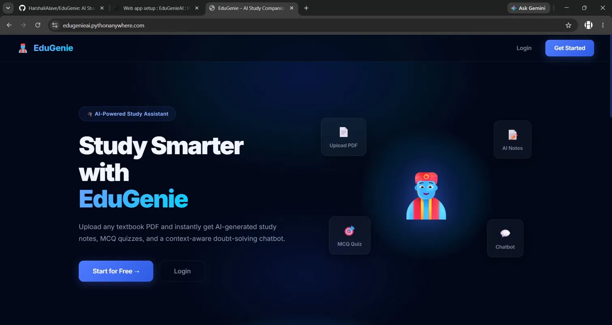
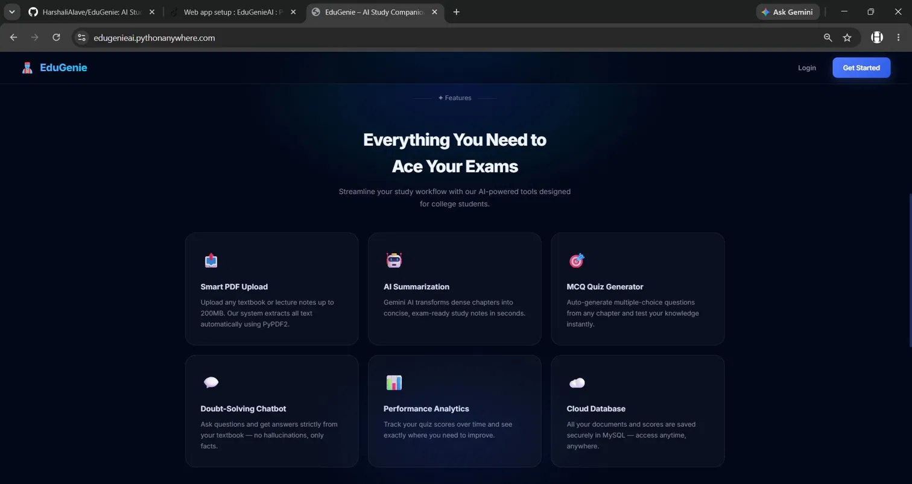
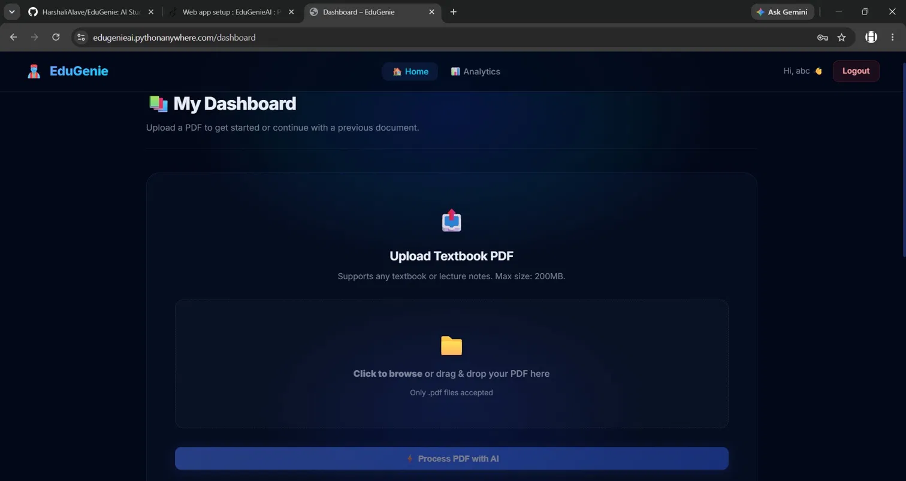
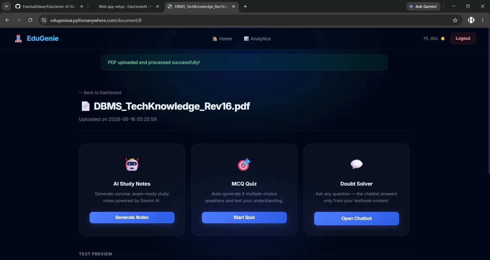
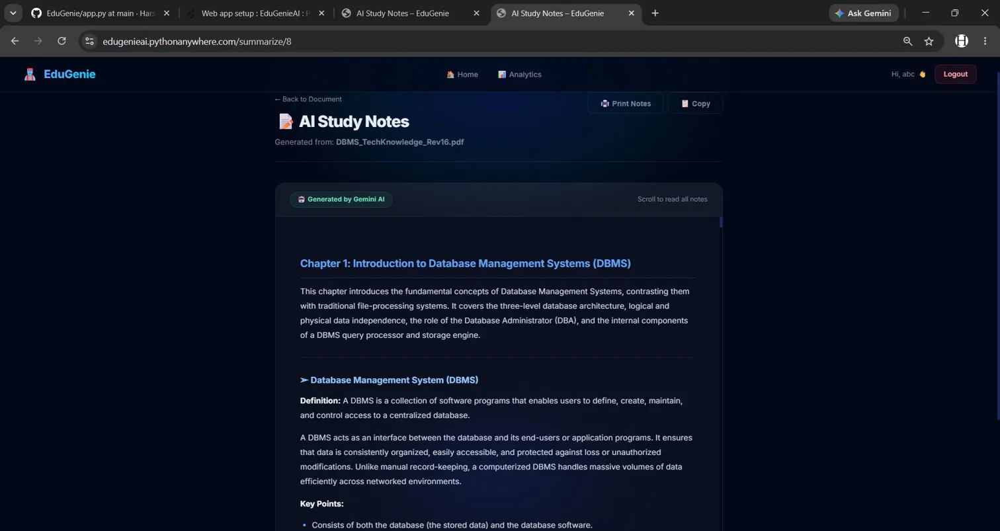
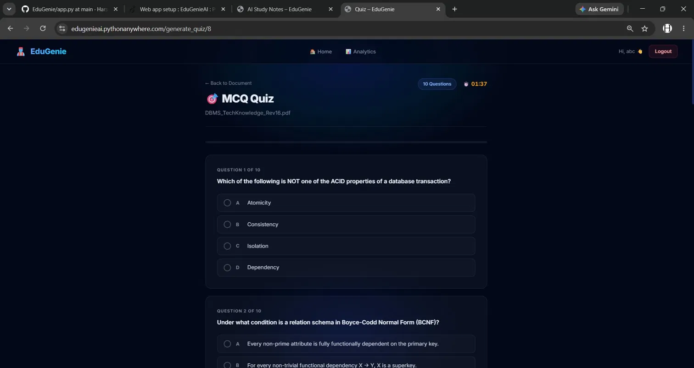
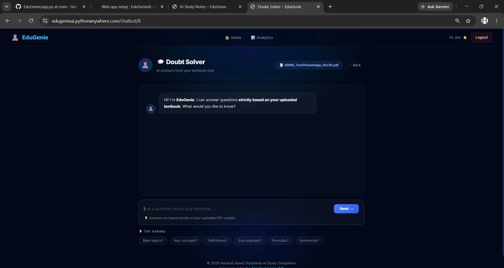
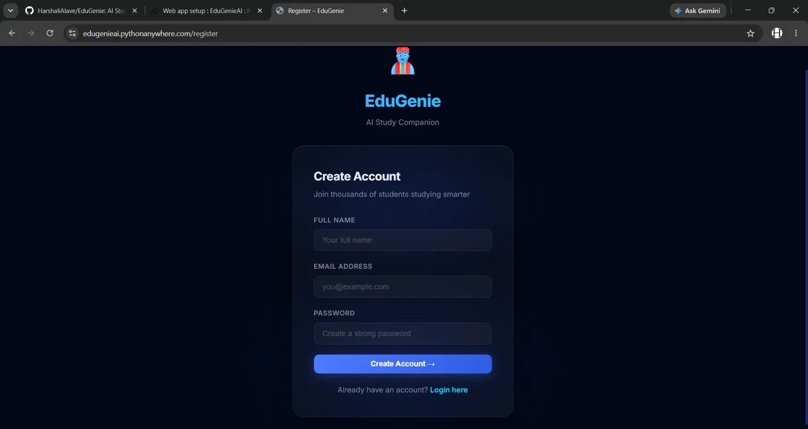
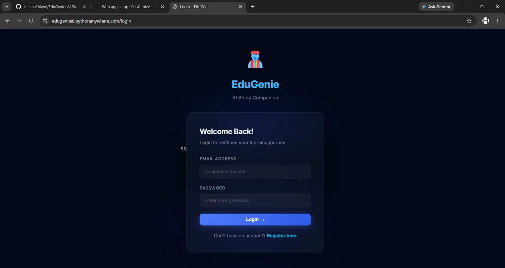

<div align="center">



# 🧞 EduGenie — AI Study Companion

[](https://python.org)
[](https://flask.palletsprojects.com)
[](https://aistudio.google.com)
[](https://mysql.com)
[](http://www.apache.org/licenses/LICENSE-2.0)
[](https://edugenieai.pythonanywhere.com)
[]()

### 🌐 [edugenieai.pythonanywhere.com](https://edugenieai.pythonanywhere.com)

*Upload any textbook PDF → Get AI study notes, MCQ quizzes & a doubt-solving chatbot — instantly.*

[✨ Features](#-features) · [📸 Screenshots](#-screenshots) · [🚀 Getting Started](#-getting-started) · [🛠️ Tech Stack](#️-tech-stack) · [⚠️ Authorship](#️-original-authorship-notice)

</div>

---

## 📌 What is EduGenie?

**EduGenie** is an AI-powered Study Companion web application built with **Python + Flask** and powered by **Google Gemini AI**. Students upload their textbook or lecture PDFs and instantly get a full suite of AI study tools — all grounded in their own material.

> 🛡️ **Zero Hallucination Policy:** EduGenie answers **only from your uploaded PDF**. If it ever uses its internal knowledge base, it **explicitly tells you** — complete transparency, always.

---

## ✨ Features

### 📄 Smart PDF Upload
Upload any textbook or lecture notes up to **200MB**. Text is automatically extracted using **PyPDF2** — no manual copy-pasting needed.

### 🤖 AI Study Notes
Gemini AI reads your uploaded PDF and generates concise, structured, **exam-ready study notes** in seconds — chapter by chapter, with definitions, key points, and explanations.

### 🎯 MCQ Quiz Generator  
Auto-generates **10 multiple-choice questions** directly from your uploaded content with a **live countdown timer**. Tests your real understanding — no generic questions, only from your textbook.

### 💬 Doubt Solver Chatbot
An intelligent chatbot that answers your questions **strictly from your textbook content**. Features quick-prompt suggestions like *"Main topics?", "Give example?", "Summarize?"* — and always tells you when using its knowledge base.

### 📊 Performance Analytics
Track your quiz scores across sessions. See exactly where you need to improve and monitor your progress over time.

### ☁️ Cloud Database (MySQL)
All your documents, scores, and sessions are saved securely in **MySQL** — access your study history anytime, from anywhere.

### 🔐 User Authentication
Secure registration and login system. Each student gets their own **private study space** with session-protected dashboard.

---

## 📸 Screenshots

### 🏠 Landing Page — Study Smarter with EduGenie


### ✨ Features — Everything You Need to Ace Your Exams


### 📊 Dashboard — Upload & Process Your PDF


### 📄 Document View — Choose Your AI Tool


### 📝 AI Study Notes — Generated by Gemini AI


### 🎯 MCQ Quiz — 10 Questions with Live Timer


### 💬 Doubt Solver — Chatbot from Your Textbook Only


### 🔐 Register & Login
| Register | Login |
|---|---|
|  |  |

---

## 🛠️ Tech Stack

| Layer | Technology | Purpose |
|---|---|---|
| **Backend** | Python 3.10+, Flask | Web server & routing |
| **AI Engine** | Google Gemini AI API | Notes, quiz & chatbot generation |
| **PDF Processing** | PyPDF2 | Text extraction from uploaded PDFs |
| **Database** | MySQL (Cloud) | User data, documents & quiz scores |
| **Authentication** | Flask-Login, Flask-Session | Secure user sessions |
| **Frontend** | HTML5, CSS3, JavaScript | UI & interactivity |
| **Hosting** | PythonAnywhere | Live web deployment |

---

## 🚀 Getting Started

### Prerequisites

```bash
Python 3.10+
pip
Git
MySQL
```

### Installation

**1. Clone the repository**

```bash
git clone https://github.com/HarshaliAlave/EduGenie.git
cd EduGenie
```

**2. Create a virtual environment**

```bash
python -m venv venv
source venv/bin/activate        # Windows: venv\Scripts\activate
```

**3. Install dependencies**

```bash
pip install -r requirements.txt
```

**4. Set up environment variables**

Create a `.env` file in the project root — **never commit this file**:

```env
SECRET_KEY=your_flask_secret_key_here
GEMINI_API_KEY=your_gemini_api_key_here
MYSQL_HOST=your_mysql_host
MYSQL_USER=your_mysql_username
MYSQL_PASSWORD=your_mysql_password
MYSQL_DB=edugenie
```

> ⚠️ Make sure `.env` is listed in your `.gitignore` — never push API keys to GitHub!

**5. Run the application**

```bash
flask run
```

Open `http://localhost:5000` in your browser. ✅

---

## 📁 Project Structure

```
EduGenie/
│
├── app.py                      # Main Flask application & all routes
├── requirements.txt            # Python dependencies
├── LICENSE                     # Apache 2.0 License
├── NOTICE.txt                  # Attribution & authorship notice
├── README.md                   # Project documentation
├── .env                        # API keys & secrets (NOT committed)
├── .gitignore                  # Ignores .env, __pycache__, uploads/
│
├── templates/                  # Jinja2 HTML templates
│   ├── base.html               # Base layout with navbar & footer
│   ├── index.html              # Landing page
│   ├── login.html              # Login page
│   ├── register.html           # Registration page
│   ├── dashboard.html          # PDF upload dashboard
│   ├── document.html           # Document view (Notes/Quiz/Chatbot)
│   ├── summarize.html          # AI Study Notes output
│   ├── quiz.html               # MCQ Quiz with timer
│   └── chatbot.html            # Doubt Solver chatbot
│
├── static/                     # Static assets
│   ├── css/                    # Stylesheets
│   ├── js/                     # JavaScript (quiz timer, chatbot, etc.)
│   └── images/                 # Icons & logo
│
└── screenshots/                # App screenshots (for README)
    ├── home.png
    ├── features.png
    ├── dashboard.png
    ├── document.png
    ├── ai_notes.png
    ├── quiz.png
    ├── chatbot.png
    ├── register.png
    └── login.png
```

---

## 🌐 Live Application

EduGenie is **live and publicly accessible**:

| Page | URL |
|---|---|
| 🏠 Home | `https://edugenieai.pythonanywhere.com/` |
| 📝 Register | `https://edugenieai.pythonanywhere.com/register` |
| 🔐 Login | `https://edugenieai.pythonanywhere.com/login` |
| 📊 Dashboard | `https://edugenieai.pythonanywhere.com/dashboard` |
| 📄 Document | `https://edugenieai.pythonanywhere.com/document/<id>` |
| 🤖 AI Notes | `https://edugenieai.pythonanywhere.com/summarize/<id>` |
| 🎯 MCQ Quiz | `https://edugenieai.pythonanywhere.com/generate_quiz/<id>` |
| 💬 Chatbot | `https://edugenieai.pythonanywhere.com/chatbot/<id>` |

---

## 🔐 Security

- API keys stored as **environment variables** — never hardcoded
- `.env` file excluded via `.gitignore`
- Passwords hashed before storing in database
- Session-protected routes — unauthorized access redirected to login
- On PythonAnywhere, keys set via the **Web tab → Environment Variables**

---

## ⚠️ Original Authorship Notice

**EduGenie AI Study Companion** was **originally conceived, designed, developed, and deployed as a web application** by **Harshali Alave**.

- 🌐 Original web app live at: **edugenieai.pythonanywhere.com**
- 📅 Web application deployed and hosted **before any derivative versions**
- 💡 All features — PDF upload, AI notes, MCQ quiz with timer, Doubt Solver chatbot, Performance Analytics, MySQL cloud database, and authentication — are the **original work of Harshali Alave**
- 🎨 All UI/UX design, dark theme, branding, and EduGenie identity created by **Harshali Alave**

Any derivative works **must comply with the Apache License 2.0**, which requires:
- ✅ Retaining this copyright notice
- ✅ Crediting the original author: **Harshali Alave**
- ✅ Including the `NOTICE.txt` file in all distributions
- ✅ Clearly stating what changes were made from the original

Failure to comply is a violation of the Apache License 2.0.

---

## 🔒 License

```
Copyright 2026 Harshali Alave

Licensed under the Apache License, Version 2.0 (the "License");
you may not use this file except in compliance with the License.
You may obtain a copy of the License at

    http://www.apache.org/licenses/LICENSE-2.0

Unless required by applicable law or agreed to in writing, software
distributed under the License is distributed on an "AS IS" BASIS,
WITHOUT WARRANTIES OR CONDITIONS OF ANY KIND, either express or implied.
See the License for the specific language governing permissions and
limitations under the License.
```

See the full [LICENSE](./LICENSE) file for details.

---

## 📬 Contact

**Harshali Alave** — Original Author & Developer

🌐 [edugenieai.pythonanywhere.com](https://edugenieai.pythonanywhere.com)  
🔗 [GitHub — HarshaliAlave](https://github.com/HarshaliAlave)  
📧 your-email@example.com

---

<div align="center">

Made with ❤️ and lots of ☕ by **Harshali Alave**

© 2026 Harshali Alave | EduGenie AI Study Companion  
Licensed under [Apache License 2.0](http://www.apache.org/licenses/LICENSE-2.0)

**🌐 Original web application — first hosted on PythonAnywhere**

</div>
